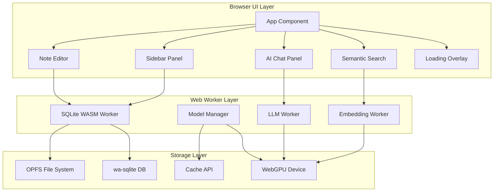

# Architecture — Index

Welcome to the SemanticNotes.ai architecture documentation. This directory contains the complete architectural design for the project.

## Document Structure

| #   | Document                                                   | Purpose                                               |
| --- | ---------------------------------------------------------- | ----------------------------------------------------- |
| 01  | [System Overview](01_system-overview.md)                   | High-level architecture, component diagram, data flow |
| 02  | [Storage Layer Spec](02_storage_layer_spec.md)             | wa-sqlite, OPFS, Web Locks, concurrency               |
| 03  | [Model Runtime Spec](03_model_runtime_spec.md)             | Transformers.js, WebGPU, model loading, caching       |
| 04  | [Embedding Pipeline Spec](04_embedding_pipeline_spec.md)   | Chunking, debounce, cosine similarity                 |
| 05  | [Context Window Spec](05_context_window_spec.md)           | Token budgeting, RAG, streaming                       |
| 06  | [Worker Threading Spec](06_worker_threading_spec.md)       | Workers, messaging, health checks                     |
| 07  | [UI State Management Spec](07_ui_state_management_spec.md) | Loading states, layout, glassmorphic theme            |

## Architecture at a Glance

## ADRs

All Architecture Decision Records are located in `adr/` subfolder:

| ADR | Title                                | Status      |
| --- | ------------------------------------ | ----------- |
| 001 | Storage & Concurrency Strategy       | ✅ Accepted |
| 002 | WebGPU & Model Runtime Strategy      | ✅ Accepted |
| 003 | Embedding & Vector Pipeline Strategy | ✅ Accepted |
| 004 | LLM & Context Window Management      | ✅ Accepted |
| 005 | Worker Isolation & Threading Model   | ✅ Accepted |
| 006 | UI & State Management                | ✅ Accepted |

## Key Decisions

- **Storage:** wa-sqlite + OPFS with Web Locks API for multi-tab consistency
- **Models:** Sequential loading to minimize VRAM (~360 MB peak vs ~710 MB)
- **Embeddings:** 256-token sliding window, Float32Array BLOB storage
- **Workers:** Typed message contract with SharedArrayBuffer transfers
- **UI:** Desktop-first 3-column glassmorphic layout
- **Security:** Local-first, zero external API keys, OPFS-backed storage

## Browser Support

| Feature           | Chrome 114+ | Firefox 125+ | Safari 15.4+ | Edge 114+ |
| ----------------- | ----------- | ------------ | ------------ | --------- |
| WebGPU            | ✅          | ✅           | ✅           | ✅        |
| OPFS              | ✅          | ✅           | ✅           | ✅        |
| Web Locks         | ✅          | ✅           | ✅           | ✅        |
| SharedArrayBuffer | ✅          | ✅           | ✅           | ✅        |
| Cache API         | ✅          | ✅           | ✅           | ✅        |
| wa-sqlite         | ✅          | ✅           | ✅           | ✅        |
