# System Architecture Overview

## SemanticNotes.ai — System Architecture

### 1. High-Level Architecture

```mermaid
architecture-beta
    group browser(cloud)[Browser]
    service ui(ui)[UI] in browser
    service workers(server)[Workers] in browser
    service storage(database)[Storage] in browser

    ui:R --> L:workers
    workers:B --> T:storage
```

### 2. Data Flow

[See section 3 of this document for the detailed sequence diagram.]

The system follows a three-tier architecture:

- **UI Layer**: React components communicating with workers via typed messages
- **Worker Layer**: Isolated Web Workers handling SQLite, embeddings, and LLM inference
- **Storage Layer**: OPFS-backed wa-sqlite with Cache API for model persistence

### 3. Technology Stack

| Layer      | Technology                        | Purpose                               |
| ---------- | --------------------------------- | ------------------------------------- |
| UI         | React + TypeScript + Tailwind CSS | Responsive glassmorphic dark theme    |
| Workers    | Web Workers (Dedicated)           | Background compute isolation          |
| Storage    | wa-sqlite + OPFS                  | Persistent key-value + vector storage |
| Embeddings | Transformers.js v3 + WebGPU       | 384-dim semantic vectors              |
| LLM        | Qwen2.5-Coder-0.5B-Instruct Q4    | Local RAG chat                        |
| Messaging  | Typed Worker Messages (ADR-005)   | Discriminated union message contract  |

### 4. Key Design Decisions

| Decision                      | Rationale                                           |
| ----------------------------- | --------------------------------------------------- |
| OPFS + Web Locks              | Multi-tab consistency without SharedWorker overhead |
| Sequential model loading      | VRAM safety on integrated GPUs                      |
| 256-token sliding window      | Optimal semantic signal for 384-dim vectors         |
| Float32Array BLOB storage     | 4× smaller than JSON string representation          |
| SharedArrayBuffer for vectors | Zero-copy embedding transfers                       |
| useReducer for loading states | Unified ready-state orchestration                   |
| Desktop-first responsive      | Full-screen 100% width/height layout                |

### 5. Performance Budgets

| Metric                                     | Target                      |
| ------------------------------------------ | --------------------------- |
| Cold start (3G)                            | ~15 seconds (710 MB models) |
| Warm start (Cache API)                     | ~2 seconds                  |
| Embedding compute (per 256-token chunk)    | ~50ms on WebGPU             |
| Cosine similarity (1,000 notes × 384 dims) | ~8ms                        |
| LLM token generation (Qwen 0.5B Q4)        | ~12 tokens/sec              |
| Peak VRAM (sequential loading)             | ~360 MB                     |
| SQLite DB size (100 notes)                 | ~200 KB                     |
| Vector store (100 notes × 384 dims)        | ~150 KB                     |

> **Cross-reference:** For the full component diagram and browser support matrix, see [Architecture Index](00_index.md). For detailed data flows, see [Embedding Pipeline Spec](04_embedding_pipeline_spec.md) and [Context Window Spec](05_context_window_spec.md).
