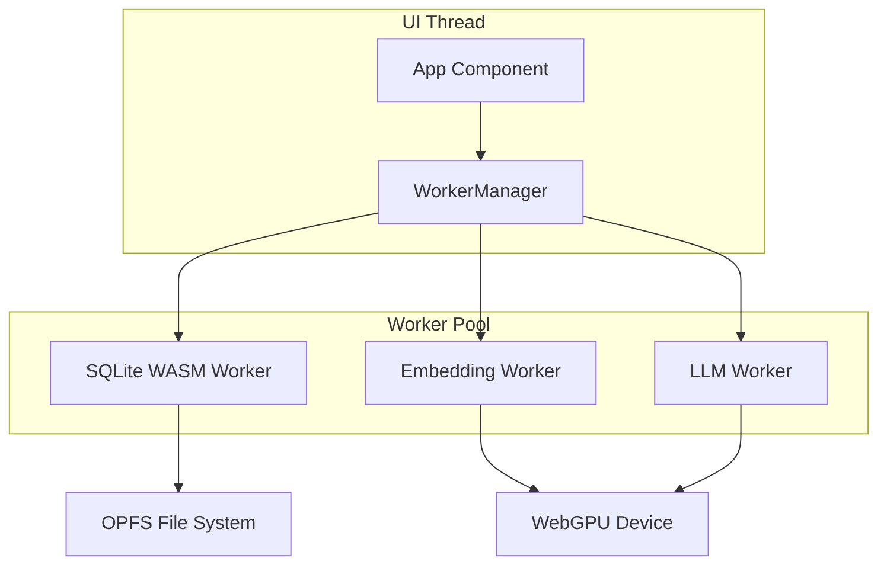

# Worker Threading Specification

## 1. Overview

The worker threading model uses **Dedicated Web Workers** for background compute isolation. Workers communicate with the UI thread via typed messages and Transferable objects for zero-copy data transfers.

## 2. Worker Architecture



## 3. Message Contract

### 3.1 Type Discriminator Pattern

```typescript
type WorkerMessageType =
  | "embedding:query"
  | "embedding:result"
  | "llm:query"
  | "llm:token"
  | "llm:done"
  | "sqlite:query"
  | "sqlite:result"
  | "sqlite:ready"
  | "worker:ping"
  | "worker:pong";

interface WorkerMessage<T extends WorkerMessageType> {
  type: T;
  payload: Extract<WorkerPayload, { type: T }>;
  timestamp: number;
  version: "v1";
}

type WorkerPayload =
  | { type: "embedding:query"; payload: { id: string; text: string } }
  | {
      type: "embedding:result";
      payload: { id: string; vector: Float32Array; score: number };
    }
  | { type: "llm:query"; payload: { question: string; context: string[] } }
  | { type: "llm:token"; payload: { token: string; confidence: number } }
  | { type: "llm:done"; payload: { text: string; duration: number } }
  | { type: "sqlite:query"; payload: { sql: string; params: any[] } }
  | { type: "sqlite:result"; payload: { row: any } }
  | { type: "sqlite:ready"; payload: { size: string; path: string } }
  | { type: "worker:ping"; payload: { timestamp: number } }
  | { type: "worker:pong"; payload: { timestamp: number } };
```

### 3.2 Message Versioning

Messages include a `version` field for backward-compatible schema evolution:

```typescript
interface WorkerMessage<T extends WorkerMessageType> {
  type: T;
  payload: Extract<WorkerPayload, { type: T }>;
  timestamp: number;
  version: "v1"; // Future: 'v2', 'v3'
}
```

## 4. WorkerManager

```typescript
export class WorkerManager {
  private embeddingWorker: Worker;
  private llmWorker: Worker;
  private sqliteWorker: Worker;
  private handlers = new Map<string, (payload: any) => void>();

  constructor() {
    this.embeddingWorker = new Worker("/workers/embedding.worker.js", {
      type: "module",
    });
    this.llmWorker = new Worker("/workers/llm.worker.js", { type: "module" });
    this.sqliteWorker = new Worker("/workers/sqlite.worker.js", {
      type: "module",
    });

    this.embeddingWorker.onmessage = this.routeMessage.bind(this);
    this.llmWorker.onmessage = this.routeMessage.bind(this);
    this.sqliteWorker.onmessage = this.routeMessage.bind(this);
  }

  private routeMessage(e: MessageEvent<WorkerMessage<WorkerMessageType>>) {
    const { type, payload } = e.data;
    const handler = this.handlers.get(type);
    if (handler) handler(payload);
    else console.warn(`Unrouted worker message: ${type}`);
  }

  on<T extends WorkerMessageType>(
    type: T,
    handler: (payload: WorkerPayload) => void,
  ): void {
    this.handlers.set(type, handler);
  }

  sendToEmbedding(
    message: WorkerMessage<"embedding:query">,
    transfers?: Transferable[],
  ): void {
    this.embeddingWorker.postMessage(message, transfers);
  }

  sendToLLM(
    message: WorkerMessage<"llm:query">,
    transfers?: Transferable[],
  ): void {
    this.llmWorker.postMessage(message, transfers);
  }

  sendToSQLite(
    message: WorkerMessage<"sqlite:query">,
    transfers?: Transferable[],
  ): void {
    this.sqliteWorker.postMessage(message, transfers);
  }

  terminate(): void {
    this.embeddingWorker.terminate();
    this.llmWorker.terminate();
    this.sqliteWorker.terminate();
  }
}
```

## 5. Data Transfer

### 5.1 SharedArrayBuffer (Primary)

```typescript
const shared = new SharedArrayBuffer(384 * 4); // 384 floats * 4 bytes
const embeddingView = new Float32Array(shared);

// Worker writes directly
embeddingView.set(computeEmbedding(text));
Atomics.notify(embeddingView, 0);

// UI thread reads without copying
Atomics.wait(embeddingView, 0, 0);
```

### 5.2 Transferable Objects (Fallback)

```typescript
// In Embedding Worker
self.postMessage(
  { type: "embedding:result", payload: { id, vector, score: 0.87 } },
  [vector.buffer], // Transferable
);

// In UI Thread
worker.onmessage = (e) => {
  const { vector } = e.data.payload;
  embeddings.set(id, vector);
};
```

## 6. Worker Health Check

### 6.1 Ping/Pong Mechanism

```typescript
interface HealthCheckConfig {
  intervalMs: number;
  timeoutMs: number;
}

const HEALTH_CHECK: HealthCheckConfig = {
  intervalMs: 30000, // 30 seconds
  timeoutMs: 5000, // 5 seconds
};

export class WorkerHealthMonitor {
  #worker: Worker;
  #interval: number;
  #config: HealthCheckConfig;

  constructor(worker: Worker, config: HealthCheckConfig) {
    this.#worker = worker;
    this.#config = config;
  }

  start(): void {
    this.#interval = window.setInterval(() => {
      this.#worker.postMessage({
        type: "worker:ping",
        payload: { timestamp: Date.now() },
        version: "v1",
      });

      const timeout = setTimeout(() => {
        this.#restartWorker();
      }, this.#config.timeoutMs);

      this.#worker.addEventListener(
        "message",
        (e) => {
          if (e.data.type === "worker:pong") {
            clearTimeout(timeout);
          }
        },
        { once: true },
      );
    }, this.#config.intervalMs);
  }

  #restartWorker(): void {
    console.warn("Worker frozen, restarting...");
    this.#worker.terminate();
    this.#worker = new Worker(this.#worker as any);
  }

  stop(): void {
    clearInterval(this.#interval);
  }
}
```

## 7. Worker Lifecycle

| Event             | Action                                     |
| ----------------- | ------------------------------------------ |
| Worker created    | Initialize with type discriminator         |
| Worker ready      | Signal 'sqlite:ready' or 'embedding:ready' |
| Worker frozen     | Health check timeout → restart             |
| Worker terminated | Dispose resources, clear handlers          |
| Worker recovered  | Re-initialize with cached state            |

## 8. Error Handling

| Error                      | Recovery                    |
| -------------------------- | --------------------------- |
| Worker crash               | Restart with state recovery |
| Message mismatch           | Type discriminator switch   |
| SharedArrayBuffer fallback | Transferable objects        |
| Worker timeout             | Health check ping/pong      |
| Worker lifecycle           | Automatic restart           |

## 9. References

- ADR-005: Worker Isolation & Threading Model
- [MDN: Web Workers](https://developer.mozilla.org/en-US/docs/Web/API/Web_Workers_API)
- [MDN: SharedArrayBuffer](https://developer.mozilla.org/en-US/docs/Web/JavaScript/Reference/Global_Objects/SharedArrayBuffer)
